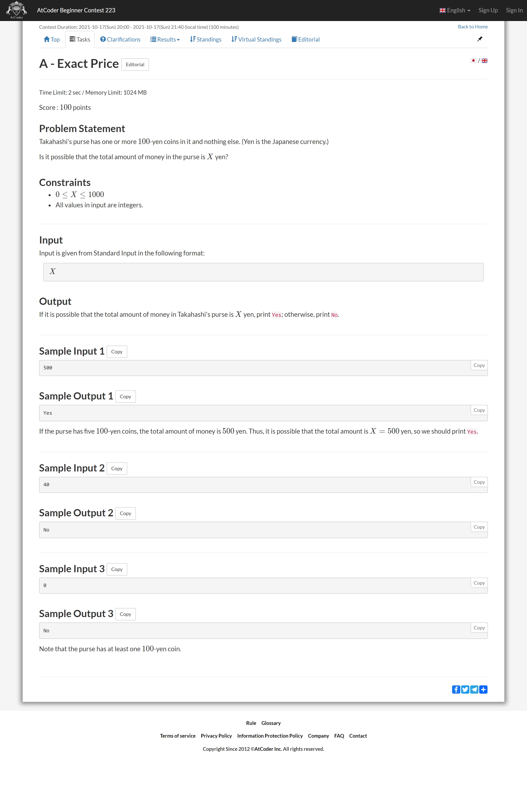
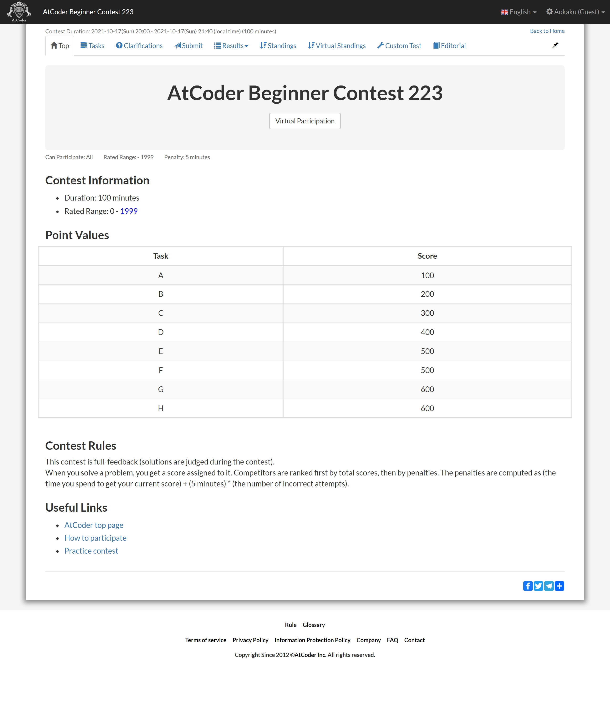
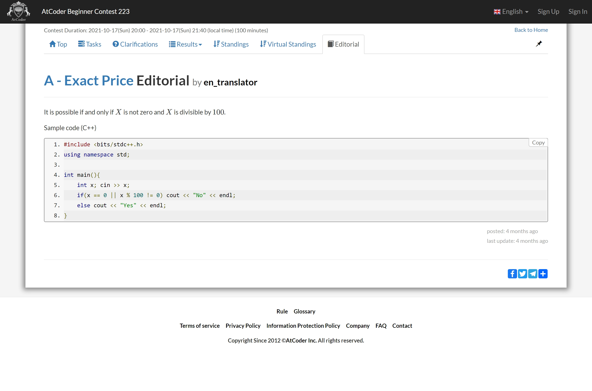

# nonebot_plugin_programming

## atcoder

### regex : `^(abc|arc|agc)[0-9]{3}[a-h]`

获取某个题的题面截图

例子: `abc223a`

### regex : `^(abc|arc|agc)[0-9]{3}(?![a-z])`

获取某场比赛主页的截图

例子: `abc223`

### regex : `^(abc|arc|agc)[0-9]{3}rk`

获取某场比赛的排名 , **需要配置登录相关**

例子: `abc223rk`

### regex : `^(abc|arc|agc)[0-9]{3}[a-h]ed`

获取某场比赛某题题解

例子: `abc223aed`

## codeforces

### regex : `^cf[0-9]+(p[0-9]+){1}`

### regex : `^cf[0-9]+[a-o]`

### regex : `^cf[0-9]+[ ].*`
